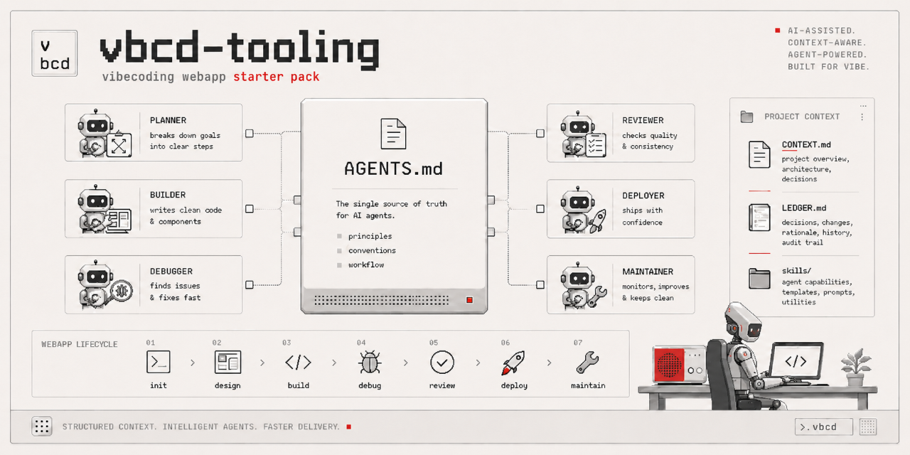

<p align="center">
  
</p>

**vbcd-tooling** · `github.com/Spofas/vbcd-tooling`

Install — pick one:

- **degit** (recommended): `npx degit Spofas/vbcd-tooling my-app && cd my-app && git init`
- **clone**: `git clone https://github.com/Spofas/vbcd-tooling my-app && cd my-app && rm -rf .git && git init`
- **ZIP**: click *Code → Download ZIP* on GitHub, unzip, work from the unzipped directory

Then read **§2 Quick start** for project setup, or **§6 Implementation phases** if you'd rather stage deployment over weeks rather than day-1.

---

# Vibecoding Webapp Starter Pack — Implementation Guide

A 16-skill + 2-complement starter pack for solo non-technical vibecoders building medium-complexity webapps with Claude Code or Codex. This README is the operator-facing manual: what each skill does, when/how/why to use it, and a step-by-step plan for deploying everything.

The skill files themselves (in `skills/<name>/SKILL.md`) are the *agent-facing* contracts. This README is the *operator-facing* explanation. They serve different readers.

> **Source provenance**: this pack derives from operator's OpenCondo project (battle-tested) + forrestchang's CLAUDE.md (NOT Karpathy-authored despite the repo name) + Pocock's `mattpocock/skills` + Anthropic's `anthropics/skills` + the wiki's accumulated synthesis. Attribution preserved per artifact.

---

## Table of contents

1. [What this is and when to use it](#1-what-this-is-and-when-to-use-it)
2. [Quick start](#2-quick-start)
3. [Pack contents](#3-pack-contents) (files-you-copy + files-that-document-the-pack + at-a-glance components)
4. [Per-skill manual](#4-per-skill-manual)
5. [The two complements](#5-the-two-complements)
6. [Implementation phases](#6-implementation-phases)
7. [Maintenance rhythm](#7-maintenance-rhythm)
8. [Verification checkpoints](#8-verification-checkpoints)
9. [FAQ and troubleshooting](#9-faq-and-troubleshooting)

---

## 1. What this is and when to use it

> **Simplicity over comprehensiveness.** Built for a solo non-technical vibecoder. Each skill in this pack earns its slot by automating a technical task the operator can't or shouldn't handle manually. Skills that demand long multi-step operator workflows, or that solve problems an operator of this profile won't realistically hit, are deliberately out of scope. When in doubt: **fewer moving parts wins.** The pack should disappear into your workflow, not become a workflow of its own.
>
> What this looks like in practice — deliberate exclusions:
> - **No CI.** Vercel-style deploy providers run build + typecheck + lint non-bypassably on every push; pre-commit hooks handle test running locally. Adding CI just to enforce discipline against yourself is overhead-heavy.
> - **Node/TypeScript only.** No multi-stack support, forks, or stack-equivalent docs. The pack assumes Vercel-style Node/TS webapps.
> - **Single pre-commit stage.** No pre-commit + pre-push split. Solo workflows commit+push atomically; splitting doubles friction without value.
> - **Skills only when leverage is real.** "Could be a skill" isn't enough; the test is "does this automate something the operator would otherwise skip, forget, or do badly?" If no, it's not a skill.

> **Dual-vendor by design (2026-05-19 restructure).** Every artifact in this pack ships in **both vendor-native locations** so that Claude Code and Codex each load their own canonical files without import-resolution overhead:
>
> - **Substrate**: `AGENTS.md` and `CLAUDE.md` are **full duplicates with identical content** (was: 1-line `@AGENTS.md` shim — superseded). AGENTS.md is the canonical for pack-maintainer edits; CLAUDE.md mirrors it.
> - **Skills**: ship in **both** `.claude/skills/<bucket>/<name>/SKILL.md` (Claude Code) AND `.agents/skills/<bucket>/<name>/SKILL.md` (Codex) — SKILL.md format is **identical cross-vendor** per the Agent Skills open standard.
> - **Vendor-specific configuration**: `.claude/settings.json` (CC, JSON) + `.codex/config.toml` (Codex, TOML). Hook configs / ignore patterns differ in format but achieve equivalent function.
> - **Ignore patterns**: `.claudeignore` (CC, path-globs) + `[permissions.default.filesystem]` entries in `.codex/config.toml` (Codex, deny-read semantics).
> - **Maintaining duplicates**: use the `/sync-vendor-files` skill (in `.claude/skills/maintain/` AND `.agents/skills/maintain/`) — invokes a Python script that mirrors AGENTS.md ↔ CLAUDE.md and `.claude/skills/` ↔ `.agents/skills/` with mtime-driven direction. Vendor-specific config files are NOT mirrored (different formats).
>
> Why duplicate instead of using imports? Per cross-vendor research: each agent loads its own canonical file natively; the prior shim approach made CC resolve an `@`-import on every session (asymmetric vs Codex's direct AGENTS.md load). Duplication is the agent-native path. Mechanism (the `/sync-vendor-files` skill) handles the maintenance cost.

**What it is.** A curated set of 16 agent skills + 2 critical complements (a pre-commit hook installer + an AGENTS.md substrate with a CLAUDE.md byte-identical duplicate) that collectively cover the full webapp lifecycle (init → design → build → debug → review → deploy → maintain). Skills are portable to either Claude Code or Codex — pack ships them in both `.claude/skills/` AND `.agents/skills/` parallel trees.

**When to use it.** When you're starting a new vibecoding webapp project from scratch (greenfield), OR when an existing project lacks structured operator-discipline tooling. The pack is heavier than nothing but lighter than authoring substrate per project; the templates persist while content is project-specific.

**Who this is for.** A solo non-technical vibecoder building medium-complexity webapps — think dashboards, internal tools, marketplaces, SaaS, content sites with non-trivial state. Not optimized for: massive enterprise codebases (under-scoped), one-shot scripts (over-engineered), pure prototypes (too much overhead).

**What it isn't.** A replacement for thinking. Skills are tools that operationalize discipline, not magic. You still need to read their output, push back when they're wrong, and exercise judgment. The pack reduces the per-decision friction of *doing* the discipline; it doesn't decide *whether* the discipline is right.

**The compounding loop this pack creates:**

1. CLAUDE.md template loads on every session (the always-present interface).
2. `/grill-with-docs` populates the project-specific bits (CONTEXT.md, ADRs, AUDIT_SCHEMA dimension checklists).
3. `/plan-review` enforces the CLAUDE.md principles before each plan ships.
4. `/tdd` + pre-commit hook enforce verification before each commit.
5. `/diagnose` + `/audit` find issues; `/ledger-capture` writes lessons to LEDGER.md.
6. `/pitfall-graduate` promotes recurring lessons from LEDGER.md to AGENTS.md's always-loaded Common Pitfalls (auto-invoked by `/ledger-capture` when criteria hit).
7. `/ledger-lint` keeps LEDGER.md honest + confirms/rolls back pending graduations; `/skill-creator` adds new skills as patterns surface.
8. `/handoff` carries state across sessions; `/deploy-and-rollback` carries it across releases.

The principles (in CLAUDE.md) → produce artifacts (CONTEXT.md, ADRs, LEDGER.md, audit reports, ...) → reinforce the principles next session.

## 2. Quick start

A ~30–60 minute setup at project init. Skip ahead to §6 for staged deployment if you'd rather not deploy everything day-1.

### Step 1: Bootstrap from this repo

Pick one install path (see top of this README). After install, in your project root:
- Substrate files at root: `AGENTS.md`, `CLAUDE.md`, `LEDGER.md`, `CONTEXT.md`
- Schema at: `plans/AUDIT_SCHEMA.md`
- Skills at: `skills/` — needs to move to your agent's harness location (next step)

### Step 2: Move skills to harness location

```bash
# Claude Code (default)
mkdir -p .claude && mv skills .claude/skills

# OR Codex
mkdir -p .agents && mv skills .agents/skills

# OR both (cross-vendor)
mkdir -p .claude/skills .agents/skills
cp -r skills/* .claude/skills/
cp -r skills/* .agents/skills/
rm -rf skills
```

### Step 3: Pre-commit hook (Node/TypeScript)

Optional first — install `gitleaks` for Tier 1 secret-scanning:

```bash
# Windows: winget install gitleaks
# macOS:   brew install gitleaks
# Linux:   github.com/gitleaks/gitleaks
```

Then in your agent:

```
/setup-pre-commit                # default — zero questions, sensible defaults
/setup-pre-commit --interactive  # opt-in interview (custom threshold, Tier 3 extensions)
```

Optional agent-side guardrails (blocks dangerous git commands):

```bash
npx skills@latest add mattpocock/skills
# Then in your agent: /git-guardrails-claude-code
```

### Step 4: Project alignment

In your agent:

```
/grill-with-docs
```

This first session is heavier than typical (~30–60 min). It populates:
- AGENTS.md placeholders (Project Principles, Quick Reference, Git Conventions, Common Pitfalls section)
- LEDGER.md `## User preferences` (commit/push behavior, model preferences, etc.)
- `CONTEXT.md` with initial 5–10 domain terms
- `plans/AUDIT_SCHEMA.md` dimension checklists (project-specific invariants)
- A few starting `docs/adr/0001-*.md` ADRs for the most consequential design decisions
- `docs/deploy-runbook.md` (built lazily on first deploy, not at init)

After this session, the substrate is alive. Subsequent skills layer on top.

### Resulting project structure

After Quick Start completes (and `/grill-with-docs` populates the placeholders), your project root looks like this:

```
my-webapp/
│
├── 📌 AI-INTERFACE (operator ↔ agent contracts)
│   ├── AGENTS.md              ← Canonical 9-section substrate, ~130 lines after /grill-with-docs
│   ├── CLAUDE.md              ← One-liner: `@AGENTS.md`
│   └── CONTEXT.md             ← Domain glossary scaffold (copied at init; terms populated by /grill-with-docs)
│
├── 📌 SESSION-SPANNING STATE
│   ├── LEDGER.md              ← 5 categories: Lessons / Rationales / Invariants / Open investigations / User preferences
│   └── CHANGELOG.md           ← Deploy log + per-push entries
│
├── 📌 VERIFICATION GATES (deterministic — complement A)
│   ├── .husky/                ← Git pre-commit hook (Node/TS only)
│   │   └── pre-commit         ← Blocks on secrets, large files, type/lint errors, tests
│   ├── .prettierrc            ← Format rules
│   └── .lintstagedrc.json     ← lint-staged config
│
├── 📌 AGENT CONFIG (per agent in use)
│   ├── .claude/               ← Claude Code (if using)
│   │   ├── settings.json      ← Permissions, model prefs
│   │   ├── skills/            ← 11 forked/authored skill templates organized into 4 buckets (init/, build/, ship/, maintain/) + installed Pocock/Anthropic skills
│   │   ├── rules/             ← Optional: path-scoped instructions
│   │   └── hooks/             ← Hook scripts /git-guardrails-claude-code installs
│   └── .agents/               ← Codex (if using)
│       └── skills/            ← Same 11 templates in 4 buckets (mirror of .claude/skills/)
│
├── 📌 docs/ (operator + agent-authored artifacts)
│   ├── ARCHITECTURE.md        ← System architecture
│   ├── STATUS.md              ← Current build state and handoff notes (auto-loaded by harness)
│   ├── TODO.md                ← Outstanding work
│   ├── IDEAS.md               ← Forward-looking ideas (uncommitted)
│   ├── PRODUCT.md             ← Product vision and features
│   ├── MANUAL_TESTS.md        ← Manual QA checklist
│   ├── deploy-runbook.md      ← /deploy-and-rollback procedures (built lazily on first deploy)
│   ├── adr/                   ← Architecture Decision Records (/grill-with-docs writes when 3-of-3 criteria met)
│   │   ├── ADR-FORMAT.md
│   │   └── 0001-*.md, 0002-*.md, …
│   ├── audits/                ← /audit reports + fix trackers
│   │   └── AUDIT_<N>_REPORT.md, AUDIT_<N>_FIXES.md
│   ├── handoffs/              ← (Optional) /handoff prompts persisted as log
│   ├── issues/                ← (Only if /to-issues local-files mode; otherwise GitHub Issues)
│   └── prds/                  ← (Only if /to-prd local-files mode; otherwise issue tracker)
│
├── 📌 plans/ (longer feature / work plans)
│   ├── AUDIT_SCHEMA.md        ← Customized from wiki template; /audit reads this every run
│   └── *.md                   ← Plan docs as needed
│
└── 📌 STANDARD WEBAPP CODE (orthogonal to this pack)
    ├── README.md, LICENSE, .gitignore
    ├── package.json (or pyproject.toml / Cargo.toml / Gemfile etc.)
    ├── tsconfig.json (or stack equivalent)
    ├── src/                   ← Application code
    └── tests/                 ← Test files (created by /tdd over time)
```

#### What's tracked vs. gitignored

**Track in git** (these are the project's living memory — teammates / future-you load them via `git pull`):
- All AI-interface files (`AGENTS.md`, `CLAUDE.md`, `CONTEXT.md`)
- All session-spanning state (`LEDGER.md`, `CHANGELOG.md`)
- All verification configs (`.husky/pre-commit`, `.gitleaks.toml`) — Prettier + lint-staged configs live inline in `package.json`
- Agent settings: `.claude/settings.json`, `.agents/` configs
- All of `docs/`
- All of `plans/`
- Source code and tests
- Skills you've forked or authored (track them — they're part of the project)

**Gitignore**:
- `node_modules/` / `.venv/` / language-specific dependency directories
- `.husky/_/` (Husky internals)
- Marketplace-installed skills (the install command is what teammates run; alternatively track for full reproducibility — operator's call)
- Build outputs (`.next/`, `dist/`, `build/`, etc.)
- Local environment files (`.env.local`, etc.) — but always commit `.env.example`

The shape mirrors the 8 AGENTS.md sections: every behavioral principle has a corresponding artifact category in the tree. AI-interface = §1–§4 + §6 + §7 in writing; session-spanning = §8; verification gates = §1 (Goal-Driven Execution) made deterministic; docs/ + plans/ = §6 + audit lifecycle. **The tree IS the operationalization of the substrate.**

## 3. Pack contents

Two categories of pack files: **files you copy into your project** (substrate templates + skills — what this repo ships) and **files that document the pack** (maintainer-side iteration tooling — kept in the maintainer's wiki, not shipped here). Don't conflate them.

### 3.1 Files you copy into your project

| File | Purpose | Copy target |
|---|---|---|
| `AGENTS.md` | 9-section substrate template (canonical; agent-agnostic) | Project root |
| `CLAUDE.md` | Full duplicate of AGENTS.md (CC loads natively; was 1-line shim until 2026-05-19) | Project root |
| `LEDGER.md` | 5-section session-spanning-knowledge skeleton | Project root |
| `CONTEXT.md` | Domain glossary scaffold (populated by `/grill-with-docs`) | Project root |
| `AUDIT_SCHEMA.md` | 9-dimension audit framework | `plans/AUDIT_SCHEMA.md` |
| `skills/init/*/SKILL.md` | Init-phase skills (`setup-pre-commit`, `grill-with-docs`) | `.claude/skills/init/` and/or `.agents/skills/init/` |
| `skills/build/*/SKILL.md` | Build-loop skills (`plan-review`, `tdd`, `diagnose`) + supporting docs | `.claude/skills/build/` and/or `.agents/skills/build/` |
| `skills/ship/*/SKILL.md` | Ship-boundary skills (`audit`, `deploy-and-rollback`, `handoff`) | `.claude/skills/ship/` and/or `.agents/skills/ship/` |
| `skills/maintain/*/SKILL.md` | Maintain-loop skills (`ledger-capture`, `pitfall-graduate`, `ledger-lint`) | `.claude/skills/maintain/` and/or `.agents/skills/maintain/` |

The Quick Start in §2 walks the actual `cp` commands.

### 3.2 Files that document the pack (kept in maintainer's wiki — NOT shipped in this repo)

| File | Purpose |
|---|---|
| `MAINTAINING.md` | Pack-development discipline (§1–§7 principles + Pack pattern + 4-actor model) |
| `GRILLING.md` | Two-phase methodology for re-grilling a skill or substrate |
| `FOLLOWUPS.md` | Operator-curated pack-maintenance backlog (active / resolved / dismissed) |

These govern *how the pack is maintained*, not what gets deployed. Operators using the pack as-is don't need them. Forkers wanting the iteration discipline can reverse-engineer from the wiki source (this repo is a release-point mirror of the maintainer's `wiki/templates/`; sync direction wiki → repo, manual).

The `README.md` you're reading doubles as both operator-facing guidebook (this file) and the repo's top-page.

### 3.3 At-a-glance: 16 skills + 2 complements

| # | Name | Phase | Source | Trigger (when to reach for it) |
|---|---|---|---|---|
| 1 | `/grill-with-docs` | Align | This pack (Pocock-copy) | Fuzzy intent; before authoring a plan; when CONTEXT.md / ADR is needed |
| 2 | `/plan-review` | Design | Author | Before approving any plan-mode output that touches >1 file or trunk |
| 3 | `/to-prd` | Design | This pack (Pocock-copy) | Convo has produced aligned intent; convert to durable spec |
| 4 | `/to-issues` | Design | This pack (Pocock-copy) | PRD ready; need to break into pickable chunks (esp. when parallelizing) |
| 5 | `/tdd` | Build | This pack (Pocock-copy) | About to implement a feature or bug fix; verification before code |
| 6 | `/frontend-design` | Build | This pack (Anthropic-copy) | Building UI; want production-grade aesthetics without art-direction |
| 7 | `/diagnose` | Debug | This pack (Pocock-copy) | Bug surfaces; need disciplined feedback loop instead of panic-prompting |
| 8 | `/webapp-testing` | Verify | This pack (Anthropic-copy) | Need Playwright UI verification (frontend behavior, screenshots, debugging) |
| 9 | `/zoom-out` | Cross-cutting | This pack (Pocock-copy) | Land in unfamiliar code; need a module-and-callers map |
| 10 | `/audit` | Review | Fork yours | Quarterly health check; or post-major-architectural-change |
| 11 | `/deploy-and-rollback` | Deploy | Author | Before any prod deploy or infra-touching change |
| 12 | `/handoff` | Cross-session | Author | End of session; before `/clear`; context heavy; handoff to other agent/operator |
| 13 | `/ledger-capture` | Maintain | Fork yours | Insight worth preserving across sessions surfaces |
| 14 | `/pitfall-graduate` | Maintain (auto + manual) | Author | LEDGER lesson hits 3 criteria; auto-invoked from `/ledger-capture` or operator-initiated for missed candidates |
| 15 | `/ledger-lint` | Maintain (1–2wk) | Fork yours | Periodic LEDGER.md hygiene + confirm/rollback of pending graduations (Step 0); biweekly cadence |
| 16 | `/skill-creator` | Meta | This pack (Anthropic-copy) | Third-repeat instruction surfaces; want eval-driven skill authoring |
| **A** | `/setup-pre-commit` | Init | This pack | One-shot project init; Tier 1 (gitleaks + large-file) + Tier 2 (Prettier + ESLint + tsc + tests with smart-skip on visual-only commits) |
| **B** | CLAUDE.md / AGENTS.md template | Init | This pack | One-shot project init; the always-loaded substrate |

**Source legend:**
- *Pocock install* — install from `mattpocock/skills` (e.g., `npx skills@latest add mattpocock/skills`)
- *Anthropic install* — install from `anthropics/skills` (e.g., `/plugin marketplace add anthropics/skills` in Claude Code)
- *Fork yours* — fork from your existing OpenCondo or equivalent battle-tested implementation; generalize to project-agnostic
- *Author* — net-new authored against the SKILL.md template provided in `wiki/templates/skills/`
- *This pack* — provided as a SKILL.md template in `wiki/templates/skills/<name>/`, or as a substrate file in `wiki/templates/<name>.md`. Either authored in this repo OR copied from an upstream source (Pocock / Anthropic) with attribution preserved in the SKILL.md frontmatter comment. Copies are made selectively for skills where deploy-time simplicity (single `cp` operation; cloud-sandbox friendliness) outweighs upstream-sync cost — flagged in the source column as `This pack (Pocock-copy)` / `This pack (Anthropic-copy)` when applicable.

## 4. Per-skill manual

Operator-side discipline (trigger + when-applicable chain ordering). For runtime mechanics, Pack calibrations, and protocol details, read the corresponding `.claude/skills/<bucket>/<name>/SKILL.md` directly (buckets: `init/`, `build/`, `ship/`, `maintain/`). Per the 4-actor model in `MAINTAINING.md`, README §4 is the Maintainer-AI + Operator reference surface; the AI consumes SKILL.md at fire time.

### 4.1 Align — `/grill-with-docs`

**What:** AI interviews you with ranked questions one at a time, each with a recommended answer. Lazily creates CONTEXT.md (domain glossary) and `docs/adr/` (architecture decision records).

**When (3 concrete triggers + 1 fallback):**
- **Project init** — the first work-defining step, before any feature code.
- **Before any large feature implementation.**
- **Before any big pivot in project direction.**
- **Fallback:** if you can't write a clear acceptance criterion before talking to Claude, run grill. Conservative — when in doubt, grill.

See `.claude/skills/init/grill-with-docs/SKILL.md` for Pocock's content + Pack calibration (15–30 question depth cap; multi-artifact closing prompts at grill-end).

### 4.2 Design — `/plan-review`, `/to-prd`, `/to-issues`

#### `/plan-review`

**What:** 6-question review of plan-mode output against AGENTS.md principles. Ends with explicit `approve` / `revise` / `re-grill` recommendation.

**When — run for:** plans that touch trunk (auth / payments / data integrity / schema / multi-tenant) OR introduce something new (feature / module boundary / external integration).

**When — skip for:** bug fixes with known root cause; styling / copy / asset changes; single-file changes following an existing pattern; refactors internal to one module.

Judgment elsewhere — when uncertain, default to running it.

See `.claude/skills/build/plan-review/SKILL.md` for Step 0 plan-shape precondition; 6 questions in §1-priority order; severity rubric with example findings; override discipline (Block-severity requires rationale).

#### `/to-prd`

**What:** Pocock-copy — synthesizes a PRD from current conversation + codebase. Destination configurable per project (issue tracker OR `docs/prds/<slug>.md`) via `conventions.md` sidecar.

**When:** after `/grill-with-docs` produced shared understanding and you want a durable artifact to hand off (to yourself across sessions, to a parallel agent, to a future maintainer).

**Chain ordering:** `/grill-with-docs` (alignment) → `/to-prd` (crystallize into durable PRD) → `/to-issues` (decompose if work spans multiple sessions). Optional bypass: skip `/to-prd` if the feature is small enough that a plan-mode output suffices.

**Conventions setup:** `conventions.md` ships alongside SKILL.md with placeholders for destination (tracker / local) + tracker URL + triage label. Populated at `/grill-with-docs` closing prompts (preferred) OR auto-populated by `/to-prd` itself on first invocation if placeholders still unfilled.

See `.claude/skills/build/to-prd/SKILL.md` for Pocock's content + Pack calibration (conventions-sidecar override of upstream Pocock-setup dependency).

#### `/to-issues`

**What:** Pocock-copy — breaks a PRD or plan into independently-grabbable vertical-slice issues. Each issue has goal + acceptance criteria + dependencies. Shares conventions sidecar pattern with `/to-prd` (tracker URL + triage label).

**When:** work is too big for one session, OR you're running parallel sessions / worktrees and need the next session to know what to grab.

**Tracker requirement:** unlike `/to-prd` (which supports `destination=local`), `/to-issues` *requires* an issue tracker. Surfaces a warning if `/to-prd` conventions show local-only.

**Conventions setup:** `conventions.md` ships with placeholders for tracker URL + triage label; populated alongside `/to-prd` conventions at `/grill-with-docs` closing prompts (single operator-input fills both files).

See `.claude/skills/build/to-issues/SKILL.md` for Pocock's content + Pack calibration (conventions sidecar overrides `/setup-matt-pocock-skills` dependency).

### 4.3 Build — `/tdd`, `/frontend-design`

#### `/tdd`

**What:** red-green-refactor in vertical slices. One test → one implementation → repeat.

**When — run for:** any change with behavior (feature, bug fix, refactor that changes behavior); **always** for trunk-touching.

**When — skip for:** pure styling / pure copy / pure asset changes (no behavior change); throwaway prototypes (explicit exception).

Default bias: **run.** TDD-first is a stated strong operator preference.

**Chain ordering with `/plan-review`:** trunk-touching changes → run **`/plan-review` → `/tdd`** (different lenses; both earn slot). Non-trunk → `/tdd`'s Step 1 is sufficient, skip `/plan-review`.

See `.claude/skills/build/tdd/SKILL.md` for Pocock's content + Pack calibration (behavior-selection anchors for Step 1's *"which behaviors matter?"* prompt) + supporting docs (`tests.md`, `mocking.md`, `deep-modules.md`, `interface-design.md`, `refactoring.md`).

**New tests are auto-discovered** by vitest/jest's glob patterns; no Tier 3 / hook reconfiguration is needed when `/tdd` adds tests for a new feature.

#### `/frontend-design`

**What:** Anthropic-copy — production-grade UI components without "AI slop" aesthetics. Framework-agnostic (React / Vue / HTML). Single-file, no sidecars.

**When:** any UI work where you don't want to art-direct manually. Foundational per operator profile (Q12 visual polish + UX smoothness load-bearing) — auto-fires on broad UI-build asks is desired here.

**Chain ordering with `/tdd`:** UI features have behavior AND aesthetics. Run `/tdd` for the behavior layer (interactions, state transitions, validation logic); run `/frontend-design` for the aesthetic layer (typography, color, motion, spatial composition). Orthogonal — both earn their slot on UI features.

See `.claude/skills/build/frontend-design/SKILL.md` for upstream content + attribution.

### 4.4 Cross-cutting — `/zoom-out`

**What:** Pocock-copy — high-level map of modules and callers in unfamiliar code, using domain glossary vocabulary. 1-line body; `disable-model-invocation: true` in frontmatter prevents auto-fire structurally (operator must explicitly invoke).

**When:** any time you land in unfamiliar code — a file you didn't write, a module that's been quiet, a part of the codebase you haven't visited in months.

**Chain ordering with `/diagnose`:** if debugging in unfamiliar code, run `/zoom-out` first for orientation, THEN `/diagnose`'s 6-phase loop. Orientation before mechanism.

See `.claude/skills/build/zoom-out/SKILL.md`.

### 4.5 Debug — `/diagnose`, `/webapp-testing`

#### `/diagnose`

**What:** 6-phase disciplined debugging loop. Phase 1 (build feedback loop) is *"the skill"* per Pocock — 90% of fixing.

**When — run for:** any bug report (broken behavior, wrong output, regression, performance degradation, intermittent failure). Default when operator describes a symptom (matches Q2 profile pattern).

**When — skip for:** clearly-trivial fixes the operator already knows the fix for (typo, missing import, obvious copy-paste error).

Default bias: **run.**

**Chain ordering with `/zoom-out`:** if the bug is in unfamiliar code, run `/zoom-out` first for orientation, THEN `/diagnose`'s 6-phase loop. Orientation before mechanism — Phase 1 (build feedback loop) is much sharper when the agent has the module map already.

See `.claude/skills/build/diagnose/SKILL.md` for Pocock's 6 phases + Pack calibration (bug-type → loop-strategy mapping for Phase 1; hypothesis-checkpoint override for trunk-touching bugs in Phase 3). **AGENTS.md §8's proactive capture-surface rule** names `/diagnose` explicitly — after Phase 6, the AI surfaces *"This bug taught us [X]. Capture as a LEDGER lesson?"*

#### `/webapp-testing`

**What:** Anthropic-copy — Playwright Python scripts for frontend behavior verification + screenshots. Ships with `scripts/with_server.py` (server-lifecycle helper) + 3 example scripts (element discovery / static HTML / console logging).

**Prereq (operator setup, one-time):** Python 3.9+ installed + `pip install playwright` + `playwright install chromium`. The agent runs Python from its own environment to test your JS/TS webapp — agent-stack and project-stack are different by design.

**When:** UI-level verification — *"does the button do what it says?"* Pairs with `/tdd` for full-stack coverage.

**Chain ordering with `/tdd`:** `/tdd` covers behavior tests at code-level (unit / integration via vitest/jest); `/webapp-testing` covers UI-level verification (real browser, real DOM, real interactions). For features that span both: write code-level tests with `/tdd` first, then validate UI behavior with `/webapp-testing` once the feature renders.

**Save behavior (pack convention; not in upstream):** default ad-hoc (print to chat only). Persist via `/webapp-testing --save <slug>` writing to `tests/e2e/<slug>.spec.py` + linking from `docs/MANUAL_TESTS.md`. Stale saved scripts surface during `/audit` TEST dimension (FOLLOWUPS pending).

See `.claude/skills/build/webapp-testing/SKILL.md` for Anthropic's body + Pack calibration (Python prereq + `--save` mode + stale-detection pointer).

### 4.6 Review — `/audit`

**What:** schema-driven 9-dimension audit. Modes: full / group / dimension / `--resume` / `--tracker`. Reads `plans/AUDIT_SCHEMA.md` for project-specific invariants. Full-scope dispatches 4 parallel sub-agents (Claude Code Agent tool with `model: opus` / Codex MultiAgentV2).

**When — run when any of these surface** (event triggers, operator-judgment-driven):

- **Before any meaningful release** — version bump / milestone / major user-facing change. *Operator decides what counts as "meaningful."* → full-scope
- **After major architectural change** — new module / schema migration / framework upgrade / new external integration / refactor touching trunk → dimension-scoped to affected area
- **After P0 incident or post-mortem** → dimension-scoped to affected area
- **Drift signals surface** — `docs/TODO.md` feels stale, codebase feels harder to navigate than it should, you find yourself avoiding certain areas. Recognizable by feel, not by threshold. → full-scope

**Cadence guideline (not a hard rule):** if no event-trigger fired in a while (rough monthly-to-quarterly hum), consider full-scope. Operator picks the rhythm.

See `.claude/skills/ship/audit/SKILL.md` for invocation modes detail, sub-agent contract, aggregation rules (ID-collision renumber / cross-phase dedup / severity reconciliation), P0 surfacing decision tree (fix-then-resume / fix-then-restart / proceed-with-P0-flagged), operator seed, Step 7 LEDGER capture trigger, Step 8 meta-review prompts.

### 4.7 Deploy — `/deploy-and-rollback`

**What:** safe-deploy sequence — pre-deploy gates → blast-radius declaration → operator-confirmed deploy → active 10-min monitor → CHANGELOG promotion → rollback path. Builds `docs/deploy-runbook.md` lazily.

**Why this isn't skippable (operator-anchored):** for an operator who's never rolled back (Q15 profile), shipping real-money paths (Q6) under zero-tolerance for breakage (Q13), the runbook is the only safety net between a bad deploy and a long incident. The first rollback you ever run will be the highest-stakes one — the friction in this protocol is what makes that first run survivable.

**When — run for:** trunk-touching commits about to deploy (auth / payments / data integrity / multi-tenant scoping / schema migration); infrastructure changes (env vars, DNS, hosting project settings, third-party integration changes). For continuous-deploy stacks (Vercel-from-`main`), invoke *before* the `git push origin main` that fires the deploy.

**When — skip for:** non-trunk feature commits, pure styling / copy / asset changes. Those go through pre-commit-hook + preview-URL-walk + judgment instead.

See `.claude/skills/ship/deploy-and-rollback/SKILL.md` for the 7-step protocol.

### 4.8 Cross-session — `/handoff`

**What:** session-end carry-over prompt. 7 buckets: state / files modified / decisions / blockers / next steps / files to load / open questions. Print-by-default; persist to `docs/handoffs/<slug>.md` on explicit request. Invocation modes (bare / mid-plan / arg-driven) adapt capture scope.

**Why this isn't optional (operator-anchored):** Q15 profile — non-technical operator can't carry session state in their head; needs it written. Q24 — 1-3 hour sessions means handoff fires effectively daily. Q22 — multi-vendor (Claude Code ↔ Codex) handoffs are real; written state is the only carrier between harnesses.

**When:** end of session; before `/clear`; when context is getting heavy (concrete signals in SKILL.md "When to invoke"); when handing off to a different worktree / agent / operator.

See `.claude/skills/ship/handoff/SKILL.md`.

### 4.9 Maintain — `/ledger-capture`, `/pitfall-graduate`, `/ledger-lint`

#### `/ledger-capture`

**What:** captures session-spanning knowledge into LEDGER.md in 5 categories: Lesson / Design rationale / Key invariant / Open investigation / Close investigation.

**When:** any time an insight matters past this session. **AGENTS.md §8's proactive capture-surface rule** means the AI prompts you automatically when work matches a LEDGER category — you don't have to remember to invoke.

See `.claude/skills/maintain/ledger-capture/SKILL.md` for category elicitation prompts with concrete examples; ADR-precedence check on the Design rationale category; Step 5 graduation check that auto-defers to `/pitfall-graduate`.

#### `/pitfall-graduate`

**What:** promotes recurring LEDGER lessons/invariants into AGENTS.md `## Common pitfalls` (always-loaded). Three criteria: frequency ≥3 / universal applicability / concision.

**When:** auto-invoked by `/ledger-capture` Step 5 when threshold hits. Operator-invokable when spotting a pattern.

See `.claude/skills/maintain/pitfall-graduate/SKILL.md` for `--auto` vs manual modes + atomic two-file commit protocol.

#### `/ledger-lint`

**What:** periodic LEDGER.md audit + pending-graduation review. Step 0 walks pending auto-graduations; Steps 1-8 are read-only LEDGER scan.

**When:** every 1–2 weeks, or after a run of merges.

See `.claude/skills/maintain/ledger-lint/SKILL.md`.

### 4.10 Meta — `/skill-creator` (install-on-demand from upstream)

**What:** Anthropic-authored — eval-driven skill-authoring meta-skill. Capture intent → draft → eval (parallel runs with-skill vs. baseline; grader subagent; HTML viewer) → description optimization (train/val splits; trigger-rate measurement; ≤5 iterations). Ships with full sidecar set (8 Python scripts + 3 subagent prompts + HTML eval viewer + reference schemas).

**Not in pack baseline (2026-05-19 restructure).** Removed because:
1. **Phase 3+ deferral** — install after 5+ custom skills exist; earlier installation is heavy machinery for first-skill authoring (the manual draft→test→iterate loop is sufficient for early skills)
2. **507-line upstream `SKILL.md`** — 7 lines over Anthropic's own newly-stated 500-line cap (per the cc-skills course, May 2026); shipping it in pack baseline propagates an upstream cap-violation
3. **Pack discipline (Thariq endorsement)** — vendor-canonical *"don't pre-bake skills"* stance (per Thariq Shihipar's *HTML effectiveness* essay, May 2026) applies — install only when the recurring need surfaces

**Install on demand** when you're authoring your 5+th custom skill:
- Claude Code: `/plugin marketplace add anthropics/skills` then `/plugin install skill-creator@anthropics/skills`
- Codex: install from the `anthropics/skills` source via Codex Skill Installer
- Manual: clone `github.com/anthropics/skills/tree/main/skill-creator` and copy `SKILL.md` + sidecars into `.claude/skills/maintain/skill-creator/` AND `.agents/skills/maintain/skill-creator/`

**Multi-vendor caveat.** Claude-Code-biased — `claude -p` subprocess + subagent orchestration semantics are Claude Code-specific. Codex operators can use the manual loop; skip Description Optimization.

## 5. The two complements

These aren't skills (recurring workflows). They're one-shot setup artifacts that the skills layer onto.

### Complement A — `/setup-pre-commit` (deterministic verification gate)

**What:** scaffolds a Node/TypeScript pre-commit hook with three tiers:

| Tier | Check | Tool | Behavior |
|---|---|---|---|
| 1 | Secret scan | `gitleaks` | Blocks commit on detected secret. The unique-to-pre-commit leverage point. |
| 1 | Large-file check | shell snippet | Blocks commit on staged files >5MB (configurable). |
| 2 | Format (auto-fix) | Prettier via lint-staged | Auto-rewrites staged files; never blocks. |
| 2 | Lint errors | ESLint via lint-staged | Blocks on errors (warnings ignored). |
| 2 | Typecheck | `tsc --noEmit` | Whole project. Blocks on type errors. |
| 2 | Unit tests | `npm test --run` | Runs only when logic files (`.ts/.tsx/.js/.jsx/.mjs/.cjs`) are staged; skipped on visual-only commits (CSS / markdown / assets). Runs the **full suite** — new tests added by `/tdd` are auto-discovered by vitest/jest glob patterns; no hook reconfiguration needed when shipping features with new tests. |
| 3 | Operator extensions | empty by default | Add commitlint / spellcheck / custom validators here. |

Runs on every `git commit`, *before* the commit lands. Target runtime ≤15s.

**When:** at project init, exactly once. Pair with `/git-guardrails-claude-code` (one-shot install via `npx skills@latest add mattpocock/skills`) which blocks dangerous git commands like `push --force` and `reset --hard` from the agent side.

**How:** invoke `/setup-pre-commit` in your agent. Two invocation modes:

- **`/setup-pre-commit`** (default) — zero questions. Accepts sensible defaults: 5MB large-file threshold, no Tier 3 extensions. Matches the pack's simplicity principle.
- **`/setup-pre-commit --interactive`** — opt-in interview if you want to customize at scaffold time (non-default threshold, declared Tier 3 extensions). Either way, the scaffolded artifacts are operator-editable after the fact.

Either mode, the skill:
- Detects the Node project
- Installs Node devDeps (`husky`, `lint-staged`, `prettier`)
- Surfaces the `gitleaks` system-install command per OS (operator runs it)
- Initializes Husky
- Writes `.husky/pre-commit` and `.gitleaks.toml`
- Merges into `package.json`: scripts (`prepare`, `typecheck`, `lint`, `verify`), top-level `prettier` key (style config), top-level `lint-staged` key (per-file-type dispatch)

After the skill runs, every commit fires the hook automatically.

**Why:** AGENTS.md tells the agent to verify; this hook makes verification **structural**. It's the only fully-deterministic gate in the pack. The agent cannot claim "tests pass" without running them, cannot leak a secret into git history, cannot commit a 50MB binary that bloats every future clone.

**The highest-leverage check is `gitleaks` (Tier 1).** It catches a class of mistake nothing else in the pack catches naturally: API keys / DB passwords / Anthropic keys staged for commit. Once a secret enters git history, you've lost — rotation is mandatory, history rewrites are painful. Pre-commit is the only stage that prevents this. Don't disable Tier 1; it's ~1 second of work for catastrophic-blast-radius coverage.

> 📌 **Stack assumption:** Node/TypeScript only. Husky + lint-staged require npm/pnpm/yarn/bun. The pack is Node-only by design.

> 📌 **Cloud-context note:** hooks travel with the repo, so they fire in Cloud Claude Code (web / mobile / GitHub app / remote routines) when the sandbox installs deps. But strength varies — in local Claude Code with `/git-guardrails-claude-code` installed, the gate is strong; in cloud sandboxes (ephemeral, iteration-pressured), agents may bypass via `--no-verify` for speed. Treat your deploy provider's build (Vercel / Netlify / Render) as the universal non-bypassable gate. This hook is the fast local-feedback accelerator on top.

> 📌 **`gitleaks` system install** (the hook calls a binary, not an npm package):
> - **macOS**: `brew install gitleaks`
> - **Windows**: `winget install gitleaks` or `scoop install gitleaks`
> - **Linux**: `apt install gitleaks` (Debian/Ubuntu) or download from [github.com/gitleaks/gitleaks/releases](https://github.com/gitleaks/gitleaks/releases)
>
> If missing, the hook surfaces a warning and skips the secret scan — but the commit proceeds. The operator must install for full Tier 1 coverage.

### Complement B — AGENTS.md substrate + CLAUDE.md duplicate (always-loaded)

**What:** the 9-section behavioral substrate the agent reads on every session. Lives canonically in `AGENTS.md`. **`CLAUDE.md` ships as a byte-identical full duplicate** of AGENTS.md so Claude Code loads it natively without import resolution (was a 1-line `@AGENTS.md` shim until the 2026-05-19 dual-vendor restructure — superseded for agent-native loading reasons). Sections: 4 from forrestchang's CLAUDE.md (Think Before Coding, Simplicity First, Surgical Changes, Goal-Driven Execution) + 1 section combining the operator's chunked-output mechanics + 3 wiki-derived (Build Shared Language, Protect Trunk Vibe Leaves, Accumulate Don't Restart) + 1 vendor-lockin avoidance (§9, added 2026-05-13). Plus a reference map, doc-update discipline, project-rules, project-principles placeholder, git-conventions, common-pitfalls placeholder.

**When:** at project init, exactly once. AGENTS.md grows organically as the project produces gotchas, principles, etc. **CLAUDE.md must stay in lockstep** — every AGENTS.md edit needs to mirror to CLAUDE.md. Use `/sync-vendor-files` to mirror after any substrate edit; or tell Claude/Codex *"mirror this change to the other file"*.

**How:** `cp wiki/templates/AGENTS.md ./AGENTS.md` and `cp wiki/templates/CLAUDE.md ./CLAUDE.md`. Symmetric copy — both files are identical at deploy. Then run `/grill-with-docs` to populate Project Principles, Quick Reference, Git Conventions, and Common Pitfalls placeholders in AGENTS.md. After `/grill-with-docs` writes to AGENTS.md, run `/sync-vendor-files` to mirror the populated content into CLAUDE.md.

**Why:** the substrate is what every session loads. If it's wrong, every session is wrong. If it's right, every session compounds on top of correct context. AGENTS.md is the highest-leverage single artifact in the project. Every other skill in this pack assumes its presence.

> 📌 **Naming note**: Both `AGENTS.md` and `CLAUDE.md` exist as byte-identical duplicates so each agent loads its own native file. Codex eager-loads `AGENTS.md` directly. Claude Code loads `CLAUDE.md` directly (no `@`-import resolution required). AGENTS.md is the **canonical for pack-maintainer edits** (the file you edit when changing substrate); CLAUDE.md is the **mirror** maintained via `/sync-vendor-files`. The agent-agnostic principle in §1 is the reason this pack ships canonical-as-AGENTS.md instead of canonical-as-CLAUDE.md.

### What's deliberately NOT a Phase 1 complement: CI

For a solo small-medium project deploying through Vercel / Netlify / Render, the deploy provider's build already does typecheck + build + lint non-bypassably on every push. Pre-commit hooks handle test running locally. The remaining value CI would add — non-bypassable test enforcement against `--no-verify` — is overhead-heavy for a solo, disciplined operator.

Add CI later when one of these triggers fires:
- **Test suite is slow** enough that local-hook execution becomes friction (move slow tests off-hook to CI on push)
- **Project grows beyond solo** — PR contributors need a non-bypassable gate they don't control
- **Compliance / audit requirement** appears
- **You switch off Vercel-style platforms** — self-hosted deploy doesn't include a build gate, so CI becomes the remote backstop

Until one of those triggers fires, CI is duplicated infrastructure for a workflow that's already covered. The pack's design treats CI as a deferred complement, not a default.

### How verification layers stack

Six layers, each catching a different class of issue. None covers everything alone; the layered design is what makes the pack hold together.

| Layer | Cadence | Bypass? | Catches |
|---|---|---|---|
| Pre-commit hook (Complement A) | Every commit | `--no-verify` | Secrets, large files, format / type / lint errors, unit-test failures (skip on visual-only) |
| Deploy provider build (Vercel / Netlify / Render) | Every push | No | Build failures, type errors, lint errors (whatever the provider runs) |
| `docs/MANUAL_TESTS.md` checklist | Per significant change | Skip a check | Known critical user paths — operator walks them in preview |
| `/webapp-testing` (Playwright) | Operator-initiated | Don't invoke | Automated UI walkthroughs; screenshots for visual regression |
| `/deploy-and-rollback` | Per production deploy | Operator override | Pre-deploy gates + blast-radius declaration + 10-min monitor + rollback path |
| `/audit` (9 dimensions) | Quarterly | N/A | Drift that per-PR review misses; surfaces stale invariants / uncovered routes / dead lessons |

The pattern: **earlier layers are fast and narrow; later layers are slow and broad.** Bypass-resistance matters most in cloud contexts — the deploy provider's build is the only layer that holds the same strength locally and in the cloud, so treat it as the universal backstop.

For a solo non-tech operator, the layers you'll most directly experience are the deploy provider's preview build (visual verification with your own eyes) and `docs/MANUAL_TESTS.md` (your hands walking critical paths). The other layers run for you — the hook on every commit, `/deploy-and-rollback` on every release, `/audit` quarterly.

## 6. Implementation phases

Don't deploy all 18 components at once. Stage by **compounding leverage** — each phase produces artifacts the next phase relies on. If you skip phases, later skills underperform because the substrate they assume isn't built.

### Phase 0 — Prerequisites (~10 min)

- [ ] Claude Code installed (or Codex, or both)
- [ ] Git repo initialized for the new project (`git init` if needed)
- [ ] Stack-specific verify command identified (e.g., `pnpm verify` / `uv run pytest && ruff check`)
- [ ] Deploy target identified (Vercel / Fly / Render / self-hosted) — for Phase 3's `/deploy-and-rollback`
- [ ] Issue tracker decision (GitHub Issues / Linear / local files in `docs/issues/`) — for `/to-issues`

### Phase 1 — Week 1: foundation (3 skills + both complements)

Skills that compound the most. Every later skill leans on these.

1. **Copy templates** (~5 min). With the 2026-05-19 dual-vendor restructure, the pack ships the END-STATE shape directly — copy the whole `wiki/templates/` tree into your project root and both vendors are configured natively:
   - `wiki/templates/AGENTS.md` → `AGENTS.md` (project root, canonical)
   - `wiki/templates/CLAUDE.md` → `CLAUDE.md` (project root, **full duplicate of AGENTS.md** — identical content; each agent loads its own native file without import-resolution overhead)
   - `wiki/templates/LEDGER.md` → `LEDGER.md` (project root)
   - `wiki/templates/CONTEXT.md` → `CONTEXT.md` (project root)
   - `wiki/templates/plans/AUDIT_SCHEMA.md` → `plans/AUDIT_SCHEMA.md`
   - `wiki/templates/.claude/` → `.claude/` (Claude Code vendor dir: `settings.json` hook config + `skills/` tree with all pack skills)
   - `wiki/templates/.agents/` → `.agents/` (Codex vendor dir: `skills/` mirror — identical SKILL.md content, different load location)
   - `wiki/templates/.codex/` → `.codex/` (Codex vendor dir: `config.toml` hook + ignore-rule config)
   - `wiki/templates/.claudeignore` → `.claudeignore` (project root; CC ignore patterns for TS/Node generated files)

   Maintaining the duplicates: edit either side, then run `/sync-vendor-files` to mirror to the other (or tell Claude/Codex *"mirror this change to the other vendor's location"*). The `/sync-vendor-files` skill is in `.claude/skills/maintain/` and `.agents/skills/maintain/`.
2. **Invoke `/setup-pre-commit`** (~15 min): the skill is in `.claude/skills/` from step 1. It detects the Node project, surfaces the `gitleaks` system-install command, installs devDeps, writes the hook + configs, and adds `package.json` scripts. Optional agent-side guardrails: install `mattpocock/skills` (`npx skills@latest add mattpocock/skills`) and run `/git-guardrails-claude-code`.
3. **Run `/grill-with-docs`** (~30–60 min): populates AGENTS.md placeholders, LEDGER.md User preferences, CONTEXT.md initial vocabulary, AUDIT_SCHEMA.md dimension checklists, first 1–3 ADRs.
4. **Verify** `/plan-review` is loaded and works on a sample plan (~5 min): produce a small plan via plan-mode, run `/plan-review`, confirm 6-question walkthrough.
5. **Verify** `/tdd` is loaded (~5 min): give it a sample feature ("add a function that adds two numbers"), confirm it writes a failing test before any implementation.

**End of Phase 1**: alignment, plan-review, verification, trunk protection — all in place. The substrate is alive.

### Phase 2 — Week 2: build/debug/review surface (5 skills)

Add the skills that make the daily build-debug-ship loop disciplined.

6. **Install `/to-prd`** — already in the templates; verify by capturing the next aligned-intent conversation as a PRD.
7. **Install `/diagnose`** — already in templates; verify by triggering a sample bug.
8. **Install `/zoom-out`** — already in templates; verify by asking it to map an unfamiliar module.
9. **Install `/frontend-design`** — `/plugin marketplace add anthropics/skills` (Claude Code) or equivalent (Codex). Install the example-skills plugin.
10. **Install `/webapp-testing`** — same install path as `/frontend-design` (it's also in `anthropics/skills`).

Each verification is light (5–10 min); the skills have been tested by their authors. You're confirming installation, not debugging.

**End of Phase 2**: build, debug, and review skills are in place. Daily-loop friction substantially reduced.

### Phase 3 — Week 3+: lifecycle, maintain, meta (7 items)

These earn their slots when specific needs surface, not preemptively.

11. **Install `/to-issues`** — when you first need to break a PRD into chunks (typically when you start running parallel sessions or worktrees, or when work outgrows a single session).
12. **Fork `/audit`** — generalize from your bagdeck implementation. ~4–6 hours: extract `AUDIT_SCHEMA.md` to be project-neutral (use the universal template as a guide), generalize phase groups, decouple from project-specific dimension checklists. Then test on the new project.
13. **Author `/deploy-and-rollback`** — the SKILL.md template is in `wiki/templates/skills/ship/deploy-and-rollback/`. Customize the deploy commands and rollback paths in `docs/deploy-runbook.md` for your stack. ~3 hours including the runbook.
14. **Author or fork `/handoff`** — the SKILL.md template is in `wiki/templates/skills/ship/handoff/`. Mostly drop-in; tune the captured-buckets per your project's session shape if needed. ~1–2 hours.
15. **Fork `/ledger-capture` + `/ledger-lint`** — generalize from your existing implementations. ~2 hours for both: extract project-specific signal sources, ensure LEDGER.md schema is project-neutral, decouple from any bagdeck-specific assumptions.
16. **Install `/skill-creator`** — once you have 5+ custom skills and want eval-driven optimization. Available in `anthropics/skills`. Use it to refine the descriptions of the skills you've forked.
17. **(Honorable mentions, not forced)** — `/prototype` when first ambiguous design question hits; `/improve-codebase-architecture` for quick-pass refactors when `/audit`'s full schema-driven run is overkill; `/zoom-out`-like tiny utilities as they emerge.

**End of Phase 3**: full lifecycle covered. The pack is operational.

### Phase 4 — Compounding (months 1+)

Phases 1–3 are the install. Phase 4 is *use*. The pack only pays off if it's actually used; the maintenance rhythm in §7 is what makes that happen.

## 7. Maintenance rhythm

The pack rewards discipline. Here's the cadence — frequencies are operator-tunable, but the order-of-magnitude matters.

### Per-session

| When | What |
|---|---|
| Session start | Skim `LEDGER.md` (auto-loaded) and `CHANGELOG.md` top 3 entries |
| Before any non-trivial implementation | Plan-mode → `/plan-review` → approve / revise / re-grill |
| When intent is fuzzy | `/grill-with-docs` before plan-mode |
| When unfamiliar code surfaces | `/zoom-out` |
| When a bug appears | `/diagnose` (don't panic-prompt) |
| When the AI corrects itself unprompted twice | `/clear` and restart with cleaner context |
| Mid-session, when context >50% | Consider `/handoff` + `/clear` |
| End of session | `/handoff` (always — even if the next session is in 5 minutes) |

### Per-commit (PR-shaped or direct)

| When | What |
|---|---|
| Before any push | Pre-commit hook runs verify (deterministic; you don't think about it) |
| Before any non-trivial commit | Re-read `LEDGER.md` per CLAUDE.md Project Rule |
| If something session-spanning emerged | `/ledger-capture` (lesson / rationale / invariant / open investigation) |
| Commit message | Conventional Commits format; audit-fix commits include `[AUDIT_<N>:<DIM>-<NN>]` |
| Update `CHANGELOG.md` `[Unreleased]` | Per the documentation-updates table |

### Per-deploy

| When | What |
|---|---|
| Before any production deploy | `/deploy-and-rollback` (full sequence) |
| Post-deploy monitor window | Watch ~10 min; rollback if signal goes bad |
| Update `CHANGELOG.md` `## [X.Y.Z]` | Bump version (semver), add deploy block |

### Biweekly (every 1–2 weeks)

| When | What |
|---|---|
| Standing reminder | Run `/ledger-lint`. Review the punch list. Action items go through `/ledger-capture`. |

### Monthly

| When | What |
|---|---|
| Roughly monthly | Scoped `/audit` on the most-active dimension — usually Foundation (DATA + ARCH + SECU). |
| Roughly monthly | Glance at the audits/ tracker. Items shipped? Items that need re-prioritizing? |

### Quarterly

| When | What |
|---|---|
| Full `/audit` | Quarterly or before a major release. Walks every dimension. |
| `/audit --tracker` cleanup | Shipped items move to CHANGELOG; deferred items get rationale. |
| AUDIT_SCHEMA meta-review (every 5 audits) | Walk the meta-checklist; amend the schema where evidence supports it. |
| CLAUDE.md Common Pitfalls review | Read the section; re-shape any gotchas that have been mooted by a fix. |
| Skills audit | Which skills haven't fired in months? Are they still earning their slot? Move to deprecated/ if not. |

### Per major change

| When | What |
|---|---|
| After a major architectural change (schema-breaking migration, authZ refactor, new integration) | Scoped `/audit` on affected dimensions before declaring the change "shipped" |
| When a third-repeat instruction surfaces | `/skill-creator` to author the new skill |

The compounding loop only works if the rhythm is honored. If skills don't fire when they should, either (a) the operator needs a reminder (CLAUDE.md or hooks can encode this) or (b) the skill earns less of its slot than expected — promote/demote accordingly during the quarterly skills audit.

## 8. Verification checkpoints

Use these checklists to know whether the pack is actually working — not just installed.

### After Phase 1 (week 1)

- [ ] `AGENTS.md` exists at project root with 8 behavioral sections + populated reference map; `CLAUDE.md` is the one-liner `@AGENTS.md`
- [ ] `LEDGER.md` exists at project root with 5-section skeleton + `## User preferences` populated by `/grill-with-docs`
- [ ] `plans/AUDIT_SCHEMA.md` exists; dimension checklists started by `/grill-with-docs`
- [ ] `CONTEXT.md` exists with at least 5 domain terms
- [ ] At least 1 ADR in `docs/adr/`
- [ ] Pre-commit hook installed; `git commit` is blocked when verify fails (test by introducing a deliberate type error)
- [ ] `/plan-review` runs against a sample plan and produces 6-question walkthrough
- [ ] `/tdd` produces a failing test before any implementation on a sample feature

### After Phase 3 (week 3+)

- [ ] All 15 skills appear in your agent's skill discovery (Claude Code: `/skills` lists them; Codex: equivalent)
- [ ] First real bug hit: `/diagnose` ran, hypothesis → fix produced. Time-to-fix measurably faster than ad-hoc prompting (subjective; trust your gut here)
- [ ] First deploy via `/deploy-and-rollback`: `CHANGELOG.md` has the entry, `docs/deploy-runbook.md` exists with stack-specific commands, monitor window observed
- [ ] At least one `/handoff` used (verify by checking how often a session opens with a clean state-restore vs. ad-hoc recap)
- [ ] At least one `/ledger-capture` written; LEDGER.md has a non-empty Lessons / Invariants / Rationales section

### After 1 month (compounding signals)

- [ ] `CONTEXT.md` has grown beyond initial 5 terms (target: 10–20)
- [ ] `docs/adr/` documents at least 3 decisions
- [ ] At least one operator-authored skill (via `/skill-creator`) — proves you've identified a recurring pattern and codified it
- [ ] `/audit` has run at least twice; produced concrete refactor recommendations the operator implemented
- [ ] `CLAUDE.md` Common Pitfalls section has at least 3 entries — proves compound engineering is happening
- [ ] `LEDGER.md` has 5+ captured invariants
- [ ] `/ledger-lint` has run at least twice; proposed cleanup actioned
- [ ] `/handoff` is reflexive at session-end (verify by recall: when did you last skip it?)

### Failure signals

- **No `/grill-with-docs` use** after week 1 → alignment is being skipped → plans will mismatch intent. Force the discipline by re-running it on the next non-trivial decision.
- **CONTEXT.md stagnant** for >2 weeks → either no new domain terms are emerging (project is mature, fine) OR `/grill-with-docs` is being skipped. Run a sanity-check `/grill-with-docs` on a recent unclear conversation.
- **LEDGER.md growing without `/ledger-lint`** → drift accumulating. Force a `/ledger-lint` pass.
- **Audits getting longer with each run** → either codebase is getting messier (likely) or schema is too permissive (run a meta-review).
- **`/plan-review` always returns "approve"** → either you've gotten better at intent (good) or plan-review is rubber-stamping (bad). Spot-check by reading 3 recent plans manually; calibrate.

If after 1 month none of the compounding signals are present, the discipline is failing — most likely `/grill-with-docs` and `/plan-review` are being skipped, the load-bearing alignment + review primitives. Restart the rhythm; consider whether the friction is real (skill is wrong) or imagined (operator habit).

## 9. FAQ and troubleshooting

### Q: My stack isn't Node — does the pack still work?

**No — this pack is Node/TypeScript only by design.** Complement A (`/setup-pre-commit`) uses Husky + lint-staged, which require npm/pnpm/yarn/bun. The pack's defaults — Prettier, ESLint, `tsc --noEmit`, `npm test` — are all Node-toolchain. Reframing them per-stack would dilute the design.

The Agent Skills format itself is stack-agnostic, so individual skills work cross-stack in principle:
- `/tdd` is language-neutral
- `/webapp-testing` requires Python + Playwright runtime; both Claude Code and Codex run them regardless of your application's stack
- `/frontend-design` defaults to React/HTML/Vue but doesn't enforce them

But the pack as a whole — substrate + pre-commit hook + AGENTS.md conventions + Quick Reference assumptions — is Node/TS. If you're on Python / Go / Rust / Ruby, you're authoring your own equivalent pack, not adapting this one.

### Q: I only use Claude Code (or only Codex). Do I still need both `.claude/skills/` and `.agents/skills/`?

No. Use only the directory matching your agent. The reason both are mentioned: portability. If you ever switch agents, having skills in both directories means zero migration. But day-1, one is fine. Skills also work cross-vendor when the *content* is portable (most are).

### Q: Should I commit the skills folder to git?

For **forked / authored** skills, yes — they're part of the project. New teammates / future-you `git pull` and have the skills.

For **marketplace-installed** skills (`mattpocock/skills`, `anthropics/skills`), gitignore them — the install command is what teammates run. Or, if you want full reproducibility, commit them too; the cost is repository size.

### Q: The first `/grill-with-docs` session is taking 2 hours, not 30–60 minutes. Is something wrong?

Probably not. The first session is heavier than subsequent ones because it's populating multiple files at once (CLAUDE.md placeholders, LEDGER.md User preferences, CONTEXT.md, AUDIT_SCHEMA.md dimensions, initial ADRs). 1–2 hours is in range for a complex domain. Subsequent runs are typically 15–30 minutes.

If the session has gone past 2 hours and you feel diminishing returns, it's fine to call it done; the substrate doesn't have to be perfect day-1. `/grill-with-docs` can be re-invoked to extend any section later.

### Q: I ran `/plan-review` and it returned "approve" with no concerns. But the plan was clearly bad. What happened?

A few possibilities, in rough order of likelihood:

1. **The plan-review skill rubber-stamped.** Verify by reading the 6 questions yourself and seeing if any concerns surface. If yes, the skill was over-charitable — flag and re-author its description to be sharper.
2. **The plan was actually fine, your gut was wrong.** Trust the skill more than your gut for things you can't read directly.
3. **The plan-review questions don't catch your concern.** You've found a gap in the 6-question walk. Add a 7th question via `/skill-creator` (eval-driven), or capture as a Lesson in `/ledger-capture`.

### Q: `/audit` produced 50+ findings. How do I prioritize?

Walk the action plan section of the audit report top-to-bottom. P0 items first (must fix before next release). P1 items next (high impact, plausible scenarios). Don't try to fix everything at once.

If 50+ feels like alert fatigue, a few options:
- **Raise the floor**: drop P3 polish into a separate "polish backlog" doc, leave only P0/P1/P2 in the action plan
- **Scope tighter**: next audit, run a single dimension or phase group, not full
- **Schema review**: if every dimension is producing many findings, the AUDIT_SCHEMA's dimension checklists may be too permissive. Run a meta-review per AUDIT_SCHEMA §13.

### Q: I never end up running `/handoff`. Sessions just end.

This is the most common discipline failure. Two paths:

1. **Make it reflexive**: add a CLAUDE.md gotcha — "End of session = `/handoff` before `/clear`. No exceptions for tasks not-yet-done." Once internalized, it becomes automatic.
2. **Lower the friction**: if `/handoff` produces too much output to bother with, customize the SKILL.md to produce a tighter handoff (just state + next steps, drop the detailed buckets).

If you genuinely don't need handoff (you finish tasks within sessions, never have multi-session work), drop `/handoff` from the pack. Better to remove a skill than have it be ceremony.

### Q: `/audit`'s parallel-sub-agent dispatch isn't working in Codex.

The skill has two paths — Claude Code (`Task` tool with `model: opus`) and Codex (`/agent` + MultiAgentV2). If Codex's MultiAgentV2 isn't yet supporting the syntax used, fall back to **sequential dispatch** — run each phase group in turn. Slower but produces equivalent output.

The skill should detect the runtime and choose the right path; if it fails, the SKILL.md may need a tweak to the Codex path. File a Lesson in LEDGER.md if you have to manually adjust.

### Q: Some skills overlap. How do I know which to use?

| If you're about to … | Use |
|---|---|
| Clarify intent before a plan | `/grill-with-docs` |
| Review a plan before approving | `/plan-review` |
| Capture intent into a spec | `/to-prd` |
| Break spec into tasks | `/to-issues` |
| Implement a feature | `/tdd` |
| Build UI | `/frontend-design` |
| Verify UI behavior | `/webapp-testing` |
| Debug a bug | `/diagnose` |
| Map unfamiliar code | `/zoom-out` |
| Refactor / find debt | `/audit` (full) or `/improve-codebase-architecture` (lighter) |
| Deploy to prod | `/deploy-and-rollback` |
| End a session | `/handoff` |
| Capture a lesson / invariant / decision | `/ledger-capture` |
| Audit LEDGER.md | `/ledger-lint` |
| Author a new skill | `/skill-creator` |

If two skills feel like they overlap and you're unsure, default to the more specific one. Skills are cheap; alignment isn't.

### Q: I'm not seeing the compounding benefits. What's wrong?

Compounding takes weeks-to-months. Quick checks:

- Is `/grill-with-docs` running on every fuzzy-intent moment? If not, the alignment isn't compounding.
- Is `/plan-review` running on every non-trivial plan? If not, plans are being approved without review and bad ones are landing.
- Is `/ledger-capture` running when insights surface? If not, knowledge is evaporating.
- Is the pre-commit hook actually blocking commits? Test by introducing a deliberate type error. If it doesn't block, the gate is broken.
- Is `/audit` running quarterly? If not, drift is accumulating.

If all of these are firing and you still don't see compounding, the discipline may be working but the metric you're measuring against is wrong. The benefits show up as: fewer incidents, less rework, faster bug-to-fix loop, more readable diffs, less cognitive load per session. They don't show up as raw speed (that's `/grill-with-docs`'s overhead) — they show up as **quality at sustainable pace**.

### Q: How do I know when to deviate from this pack?

Anytime the friction of a skill exceeds its value. Signs:

- A skill never fires when it should → drop it; the operator clearly doesn't believe in it
- A skill always fires when it shouldn't → tune the description to be more specific
- A skill produces output that's always ignored → either tune the skill or drop it
- A skill that "should" exist isn't in the pack → author it via `/skill-creator`

The pack is a starting point, not a contract. Your project's operator-knowledge will diverge from the universal version. Capture divergences in LEDGER.md or in CLAUDE.md project-specific sections; let the universal pack serve as the foundation, not the ceiling.

---

**End of guide.** For the canonical plan this guide implements, see `C:\Users\Spofas\.claude\plans\serene-purring-pine.md`. For per-skill mechanics, see each `skills/<name>/SKILL.md` (agent-facing); this README is the operator-facing companion.
